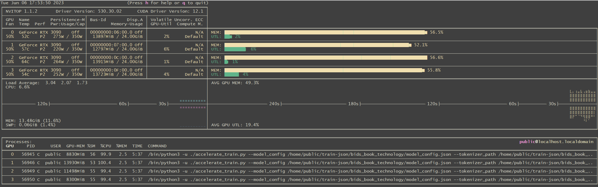

# GPT2-Chinese

## Description

- Chinese version of GPT2 training code, using BERT tokenizer or BPE tokenizer. It is based on the extremely awesome repository from HuggingFace team [Transformers](https://github.com/huggingface/transformers). Can write poems, news, novels, or train general language models. Support char level, word level and BPE level. Support large training corpus.
- 中文的GPT2训练代码，使用BERT的Tokenizer或Sentencepiece的BPE model（感谢[kangzhonghua](https://github.com/kangzhonghua)的贡献，实现BPE模式需要略微修改train.py的代码）。可以写诗，新闻，小说，或是训练通用语言模型。支持字为单位或是分词模式或是BPE模式（需要略微修改train.py的代码）。支持大语料训练。

 #### 项目基于 https://github.com/Morizeyao/GPT2-Chinese ,在此项目上,添加结巴分词器以及做了如下改造。

----
## UPDATE 05.2023
+ 简化单卡训练代码 train.py ,默认使用jieba分词
+ 新增accelerate 分布式训练代码 accelerate_train.py,默认使用jieba分词
+ 
+ 准备待训练json文件,建议每个正文内容不超过256字,如果文章内容过长，可以切分成多段，如下格式：
~~~
  ["第一篇文章的正文", "第二篇文章的正文", "第三篇文章的正文"]
~~~
----
